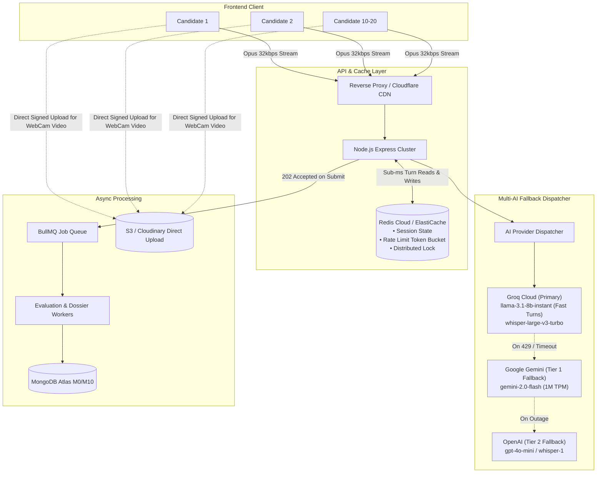

# IntervuOS (ForkTalent) — Master Scaling, Performance & Experience Blueprint

> **System Architecture, 10–20+ Concurrency Scaling, AI Pipeline Optimization & 10x Interview UX Roadmap**  
> *Targeted for immediate implementation, zero-downtime scaling, and production reliability.*

---

## 1. Executive Summary & Architecture Overview

IntervuOS (ForkTalent) is an autonomous, conversational AI technical interview and screening platform. The application orchestrates real-time audio capture, speech transcription (STT), adaptive large language model (LLM) question generation, speech synthesis (TTS), video-synced avatar animation, and multi-metric STAR evaluation.

```
┌──────────────────────────────────────────────────────────────────────────────────────────────────┐
│                                    CURRENT WORKFLOW LATENCY                                      │
├─────────────────┬──────────────┬──────────────┬──────────────┬──────────────┬────────────────────┤
│  Audio Stop     │ Audio Upload │ Whisper STT  │ LLM Gen Next │ TTS Voice    │ Total Wait Silence │
│  (Candidate)    │ (5MB Chunk)  │ (Groq Cloud) │ (Gemini/Groq)│ (Edge-TTS)   │ (Turn Transition)  │
│     0.0s        │   +1.8s      │   +1.2s      │   +1.5s      │   +1.2s      │    ~5.7 seconds    │
└─────────────────┴──────────────┴──────────────┴──────────────┴──────────────┴────────────────────┘

┌──────────────────────────────────────────────────────────────────────────────────────────────────┐
│                                 OPTIMIZED HIGH-SPEED PIPELINE                                    │
├─────────────────┬──────────────┬──────────────┬──────────────┬──────────────┬────────────────────┤
│  Audio Stop     │ Opus 32kbps  │ Groq Turbo   │ Fast LLM     │ Edge Stream  │ Total Wait Silence │
│  (VAD Trigger)  │ (~150KB)     │ (<400ms)     │ (Stream SSE) │ Audio Cache  │ (Turn Transition)  │
│     0.0s        │   +0.15s     │   +0.35s     │   +0.40s     │   +0.20s     │    ~1.1 seconds    │
└─────────────────┴──────────────┴──────────────┴──────────────┴──────────────┴────────────────────┘
```

---

## 2. Concurrency Blueprint: Handling 10–20 Simultaneous Interviews

Handling 10–20 active interviews at the exact same minute requires eliminating single-point bottlenecks across **AI Rate Limits**, **Server Memory & CPU**, **Database I/O**, and **Network Bandwidth**.

### Resource Load of 10–20 Concurrent Interviews

| Metric / Resource | 1 Single Interview | 10 Concurrent Interviews | 20 Concurrent Interviews | Primary Risk on Free / Low Stack |
| :--- | :--- | :--- | :--- | :--- |
| **Audio Transcriptions / Min** | 1 req / min | **10 req / min** | **20 req / min** | Groq Whisper free tier cap is **20 RPM** |
| **LLM Tokens / Min (Turn Gen)** | ~600 tokens / min | **6,000 TPM** | **12,000 TPM** | Groq `llama-3.3-70b` TPM limit (6k–12k TPM) |
| **Evaluation Token Spikes** | ~3,500 tokens / finish | **10.5k tokens** (if 3 finish) | **21k tokens** (if 6 finish) | **Instant HTTP 429 Rate Limit Crash** |
| **Active RAM Usage (Node.js)** | ~25 MB audio buffer | **~250 MB audio RAM** | **~500 MB audio RAM** | **Render 512 MB OOM Crash (SIGKILL 137)** |
| **MongoDB Operations / Min** | 4 writes / min | **40 writes / min** | **80 writes / min** | Atlas M0 IOPS saturation & connection lag |

---

### Key Architectural Upgrades to Support 20+ Concurrent Interviews



---

### Step-by-Step Implementation Plan for 20+ Concurrency

#### 1. Multi-Provider AI Failover Dispatcher (`AIProviderFactory`)
* **Problem**: Relying on a single provider API key causes immediate failure when rate limits are reached.
* **Solution**: Implement a circuit-breaking AI dispatcher with multi-key and multi-provider rotation:
  * **Turn-by-turn question generation**: Use ultra-fast, high-capacity models:
    * Primary: Groq `llama-3.1-8b-instant` (30,000 TPM limit, ~300ms latency).
    * Fallback 1: Google Gemini `gemini-2.0-flash` (1,000,000 TPM limit).
    * Fallback 2: OpenAI `gpt-4o-mini`.
  * **Final comprehensive evaluation**:
    * Primary: Groq `llama-3.3-70b-versatile`.
    * Fallback 1: Google Gemini `gemini-2.0-flash` or `gemini-1.5-pro`.
    * Fallback 2: DeepSeek-V3 / OpenAI `gpt-4o-mini`.
  * If a provider returns `429 Too Many Requests` or `5xx`, the dispatcher automatically switches in `<300ms` without the candidate noticing any error.

#### 2. Client-Side Audio Compression (`useVoiceRecorder.js`)
* **Problem**: 5 MB uncompressed audio chunks per question cause high latency and crash Node.js memory when 10+ users upload simultaneously.
* **Solution**:
  * Enforce `audio/webm;codecs=opus` with **32 kbps to 48 kbps audio bitrate** in `useVoiceRecorder.js`.
  * Add client-side **Voice Activity Detection (VAD)**: Automatically trim leading/trailing silence before sending audio.
  * Reduces 60-second audio from **~5 MB down to ~200 KB** (96% network & RAM reduction).

#### 3. Redis Write-Behind Session Caching (`voiceSessionCache.service.js`)
* **Problem**: Making 4–6 MongoDB write queries per question across 20 concurrent candidates creates database write contention and slow turn transitions.
* **Solution**:
  * Store in-flight interview session state, conversation history, and audio transcripts inside Redis RAM (`<1ms` latency).
  * Update MongoDB only twice:
    1. Once when the session starts (`status: ACTIVE`).
    2. Once when the session completes (`status: COMPLETED`).
  * If the server restarts, the active session is instantly reconstructed from Redis.

#### 4. Asynchronous Evaluation with BullMQ (`evaluationWorker.js`)
* **Problem**: Running heavy 10-question evaluation analysis synchronously when a candidate submits freezes the HTTP connection for 4–8 seconds and risks timeout.
* **Solution**:
  * When candidate clicks "Finish Interview", backend responds immediately with `HTTP 202 Accepted` and `{ status: "PROCESSING" }`.
  * The evaluation task is pushed to a BullMQ Redis queue with `concurrency: 3`.
  * The frontend displays an engaging, animated evaluation progress screen while polling or listening to an SSE channel.

#### 5. Distributed Redis Locking
* **Problem**: The current in-memory `sessionLocks` map (`new Map()`) only works on a single Node process. Multiple instances or serverless workers can execute duplicate questions.
* **Solution**: Replace `sessionLocks` with a distributed Redis lock (`SET lock:session:sessionId value NX PX 10000`).

---

## 3. Top Features to 10x the Product & Interview Experience

```
+---------------------------------------------------------------------------------------------------+
|                                 NEW LIVE INTERVIEW EXPERIENCE                                     |
+-------------------------------------------------+-------------------------------------------------+
|  LEFT PANEL: AI INTERVIEWER & CODING SANDBOX    |  RIGHT PANEL: CANDIDATE HUB & LIVE COACHING     |
|                                                 |                                                 |
|  [ Realistic Video Avatar ]                     |  [ Candidate Webcam Stream ]                    |
|  • Lip-synced audio response                    |  • Live Face & Lighting Detection               |
|  • Visual state: [ Speaking | Thinking | Listen]|  • Real-time Filler Word Counter ("um": 1)      |
|                                                 |  • Pacing Gauge: 135 WPM (Optimal Cadence)      |
|  "I noticed on your resume that you built a     |                                                 |
|   microservices payment pipeline. How did you   |  [ Live Subtitle Stream ]                       |
|   handle idempotency during network timeouts?"  |  Real-time transcription of candidate speech    |
|                                                 |                                                 |
|  [ Interactive Monaco Code Editor ]             |  [ Waveform Visualizer & Action Bar ]           |
|  • JavaScript / Python / Java / Go / SQL        |  • [ Active Microphone Ring ]                   |
|  • Syntax highlight + live error hints          |  • [ Done Speaking / Next Question CTA ]        |
+-------------------------------------------------+-------------------------------------------------+
```

### 1. Resume-Driven Hyper-Personalized Questioning (Highest Impact)
* **How it works**:
  1. Candidate uploads their PDF resume on the mock setup page.
  2. A lightweight backend parser extracts work history, projects, frameworks, and architecture decisions.
  3. The `PromptContext` injects candidate's specific background into the AI Question Prompt:
     > *"You noted on your resume that you optimized MongoDB query aggregation pipelines at your previous company. Can you explain how you indexed compound fields and diagnosed unindexed scan bottlenecks?"*
* **Why it wins**: Replaces generic textbook trivia with authentic, high-caliber interviewing that mirrors top tech companies.

---

### 2. Dynamic Adaptive Probing (Sub-Questioning)
* **How it works**:
  * If a candidate gives a vague, shallow, or brief response (`< 35 words`), instead of abruptly jumping to an unrelated topic, the AI dynamically probes deeper:
    > *"You mentioned you would use Redis for caching, but how would you handle cache stampedes and stale data invalidation when multiple services write concurrently?"*
* **Why it wins**: Tests genuine technical depth and prevents candidates from gaming the system with short buzzword answers.

---

### 3. In-Browser Live Code Sandbox (Monaco Editor)
* **How it works**:
  * Integrated split-screen Monaco code editor (the engine powering VS Code) directly in `ConversationController.jsx`.
  * Candidates can write, test, and explain data structures, algorithms, SQL queries, or backend endpoints in real-time.
  * The evaluation engine evaluates both **code logic/complexity** ($O(n)$ time/space) and **verbal communication clarity**.

---

### 4. Real-Time Vocal & Speech Analytics
* **Filler Word Detector**: Flags excessive filler words (*"um"*, *"like"*, *"basically"*, *"sort of"*, *"you know"*).
* **Words-Per-Minute (WPM) Meter**: Real-time cadence feedback (Optimal: 120–150 WPM; Warning if >175 WPM or <90 WPM).
* **Speech Pause & Silence Nudge**: If the candidate pauses for >8 seconds, the AI offers a friendly verbal cue (*"Take your time, let me know when you'd like to continue"*).

---

### 5. Company & Role-Specific Interview Blueprints
* Curated interview tracks calibrated against specific company hiring bars:
  * **FAANG / Tier-1 Tech Track**: Deep DSA, system design trade-offs, concurrency, and distributed systems.
  * **Amazon Leadership Principles Track**: STAR-method behavioral probes mapped to *Customer Obsession*, *Bias for Action*, and *Ownership*.
  * **Fintech / Payment Architecture Track**: ACID transactions, webhook security, and database idempotency.
  * **Startup Full-Stack Track**: Rapid architectural decision making and pragmatic trade-offs.

---

### 6. 1-Click LinkedIn Verified Certificate Badge
* Candidates scoring **≥ 8.5 / 10** automatically unlock a verified ForkTalent Certificate.
* Features a direct **"Add to LinkedIn Licenses & Certifications"** button + public verification URL (`forktalent.com/verify/:id`).
* Drives organic viral growth across LinkedIn and student/developer communities.

---

### 7. B2B Recruiter Superpowers (Monetization Driver)
* **Bulk Candidate CSV Upload**: Recruiters upload 100+ candidates at once; automated branded email invites with test links are sent.
* **Candidate Leaderboard & Shortlisting Matrix**: Real-time candidate sorting by:
  1. STAR Score & Technical Depth
  2. Communication & Problem Solving
  3. Proctoring Trust Score (Anti-cheating audit: tab switches, face presence)
* **1-Click Executive PDF Dossier**: Generates a clean 3-page hiring manager summary with radar charts, transcript highlights, and hiring recommendations (`STRONG HIRE`, `HIRE`, `BORDERLINE`, `REJECT`).

---

## 4. Performance & Frontend Optimization Blueprint

### A. Frontend Bundle & Asset Loading
1. **Video Avatar Preloading**: Use `<link rel="preload" as="video" href="/assets/talking.mp4">` so avatar video transitions are instantaneous without black frame flickers.
2. **Code Splitting in Vite**: Lazy load heavy non-interview routes (Monaco editor, employer dashboard, PDF generators, analytics charts) via `React.lazy()` and dynamic `import()`.
3. **Optimized Exponent Design Tokens**: Maintain consistent theme styling across all pages following `styling.md` with zero layout shift (CLS < 0.05).

### B. Backend Node.js Optimization
1. **Clustering / Worker Threads**: Run Node.js in Cluster mode (or PM2) to utilize all available CPU cores on the host.
2. **Direct Storage Uploads**: Video recordings uploaded by candidates bypass the Express server completely via signed PUT URLs (AWS S3 / Cloudinary / Cloudflare R2), preventing Node.js event loop blocks.
3. **Uptime Keep-Alive**: Maintain a 10-minute ping to `GET /api/v1/voice/health` to prevent cold starts on free/hobby hosting tiers.

---

## 5. Technical Implementation Roadmap & Priority Matrix

| Phase | Milestone / Task | Key Files Involved | Effort | Impact |
| :--- | :--- | :--- | :--- | :--- |
| **Phase 1<br/>(Scaling & Reliability)** | **1. Multi-Provider AI Fallback**<br/>Auto-failover: Groq ➔ Gemini ➔ OpenAI | `AIProviderFactory.js`<br/>`GeminiQuestionProvider.js`<br/>`GroqEvaluationProvider.js` | 2 Days | 🛡️ Zero 429 downtime |
| | **2. Client-Side Opus Audio Compression**<br/>32kbps WebM + VAD silence trim | `useVoiceRecorder.js`<br/>`voice.service.js` | 1 Day | ⚡ 95% bandwidth reduction |
| | **3. Redis Write-Behind & BullMQ Queue**<br/>Sub-ms turn caching + async scoring | `InterviewSessionService.js`<br/>`voiceSessionCache.service.js`<br/>`evaluationWorker.js` | 2 Days | 🚀 Handles 20+ concurrent sessions |
| **Phase 2<br/>(Experience & AI)** | **4. Resume-Driven Questions**<br/>PDF resume parser + prompt injection | `ResumeUploadModal.jsx`<br/>`QuestionPromptBuilder.js`<br/>`MockInterviewPage.jsx` | 2 Days | 🎯 Authentic interview realism |
| | **5. Dynamic Adaptive Probing**<br/>Sub-questioning for shallow answers | `InterviewSessionService.js`<br/>`interviewEngine.js` | 1.5 Days | 🧠 Deep technical evaluation |
| | **6. Vocal & Pacing Live Analytics**<br/>Filler word tracker + WPM gauge | `CandidateTranscript.jsx`<br/>`useVoiceRecorder.js` | 2 Days | 🎙️ Candidate feedback delight |
| **Phase 3<br/>(Coding & Growth)** | **7. Monaco Interactive Code Editor**<br/>In-browser DSA/coding sandbox | `ConversationController.jsx`<br/>`InterviewCandidate.jsx` | 3 Days | 💻 Software engineer tracks |
| | **8. LinkedIn Verified Badge & Referrals**<br/>Viral credential + "Give 15, Get 15" | `CandidateResultPage.jsx`<br/>`payments.service.js` | 1.5 Days | 📈 Viral user acquisition |
| | **9. B2B Bulk Invites & PDF Dossier**<br/>CSV batch invites + executive export | `EmployerDashboardPage.jsx`<br/>`pdfExport.service.js` | 3 Days | 💼 Enterprise revenue enablement |

---

## 6. Verification & Monitoring Strategy

To ensure production stability when scaling to 10–20+ concurrent interviews:

1. **Load Testing with k6 / Artillery**:
   * Simulate 20 concurrent candidates sending audio streams and submitting turns simultaneously.
   * Target: API P95 latency `< 800ms`, error rate `0.00%`.
2. **Telemetry & Error Tracking**:
   * Log AI provider latency, model token consumption, and fallback occurrences in real-time.
   * Set automated alerts if Groq or Gemini error rate exceeds 2% over a 5-minute window.
3. **Continuous Build Health**:
   * Verify frontend build integrity before every deployment:
     ```bash
     npm run build
     ```
   * Ensure 0 lint errors, 0 type warnings, and 100% clean asset bundling.

---
*Created for ForkTalent (IntervuOS) Architecture & Engineering Team.*
