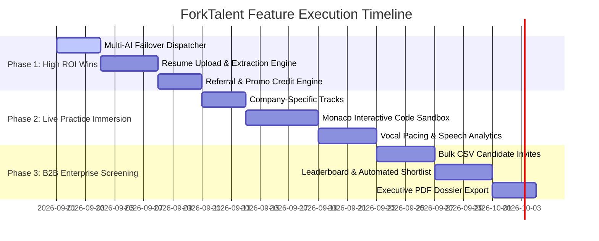

# ForkTalent — Product Feature Roadmap & Strategic Improvements

This document outlines the strategic enhancements, new high-impact features, architectural upgrades, and growth mechanisms designed to elevate **ForkTalent** into an industry-leading AI Technical Interview & Screening platform.

---

## 1. Executive Summary & Impact Matrix

| Feature / Upgrade | Target Audience | Business Impact | Dev Effort | Priority |
| :--- | :--- | :--- | :--- | :--- |
| **Resume-Driven Personalized Questions** | Candidates | 🚀 Massive UX & conversion lift | 2–3 Days | **P0 (Immediate)** |
| **Multi-Provider AI Fallback (Groq ↔ Gemini ↔ OpenAI)** | System / All | 🛡️ 99.9% uptime & 0 rate-limit crashes | 1–2 Days | **P0 (Immediate)** |
| **Interactive In-Browser Code Sandbox (Monaco Editor)** | Tech Candidates | 💻 Essential for Coding/DSA interviews | 3–4 Days | **P1 (High)** |
| **Referral Engine ("Give 15, Get 15 Credits")** | Candidates | 📈 Viral organic user acquisition | 1–2 Days | **P1 (High)** |
| **Company-Specific Simulation Tracks (FAANG / Startups)** | Candidates | 💰 Higher ARPU & paid pack conversions | 2 Days | **P1 (High)** |
| **B2B Bulk Candidate CSV Invites & Leaderboard** | Employers | 🏢 Unlocks enterprise sales & B2B revenue | 3–4 Days | **P1 (High)** |
| **1-Click Executive PDF Candidate Dossier** | Employers | 📑 Streamlines recruiter decision-making | 2 Days | **P2 (Medium)** |
| **Vocal, Pacing & Body Language Analytics** | Candidates | 🎯 Deeper diagnostic value | 3 Days | **P2 (Medium)** |
| **Redis Active Turn Caching + BullMQ Workers** | Architecture | ⚡ Sub-second latency & async evaluations | 3–4 Days | **P2 (Medium)** |
| **LinkedIn Verified Scorecard Certificate Badge** | Growth | 🌐 Free organic viral marketing | 1 Day | **P2 (Medium)** |

---

## 2. Candidate Experience & "WOW" Factor

```
                                  +------------------------------------+
                                  |      CANDIDATE INTERVIEW LAB       |
                                  +-----------------+------------------+
                                                    |
         +--------------------------+---------------+--------------------------+
         |                          |                                          |
         v                          v                                          v
+------------------+      +--------------------+                             +--------------------+
|  Resume-Tailored |      | Monaco Code Editor |                             | Company Blueprints |
|  Deep Probing    |      | Live Exec Sandbox  |                             | Google / Amazon /  |
+------------------+      +--------------------+                             | Fintech Tracks     |
                                                                             +--------------------+
```

### A. Resume-Driven Personalized Mock Interviews (Highest ROI)
* **How it works:**
  1. Candidate uploads their PDF resume prior to starting the mock interview.
  2. A lightweight backend parser extracts work history, projects, tech stacks, and metrics.
  3. The `PromptContext` injects candidate's specific background into the AI Question Generator.
* **Sample Interaction:**
  > *"I noticed on your resume that you architected a distributed cache using Redis and RabbitMQ at your previous company. Can you walk me through how you handled cache invalidation and thundering herd problems during traffic spikes?"*
* **Value Proposition:** Replaces generic textbook questions with authentic, hyper-personalized questioning that mirrors real FAANG / top startup hiring loops.

---

### B. Interactive In-Browser Code Sandbox (Monaco Editor)
* **How it works:**
  * Embed a split-screen live code editor (powered by Monaco Editor, the engine behind VS Code) right next to the AI interviewer.
  * Supported languages: JavaScript, TypeScript, Python, Java, C++, Go, SQL.
  * Candidate writes and refactors code while verbally explaining their thought process.
  * The AI analyzes both **code correctness** (algorithmic time/space complexity) and **verbal communication skills**.

---

### C. Company-Specific Interview Tracks
* Curated interview blueprints calibrated against verified hiring bars:
  * **Google SDE Track:** Complex data structures, algorithmic edge cases, dynamic programming, and high-scale system design.
  * **Amazon Leadership Principles Track:** STAR-method behavioral probes mapped to Customer Obsession, Ownership, and Bias for Action.
  * **Fintech / Payment Track:** Database transactions, idempotency, security, and webhook reliability.
  * **Startup Full-Stack Rapid Track:** Fast decision-making, pragmatic architecture, and cross-functional problem solving.
* **Monetization Hook:** Sell company-targeted packs (e.g. ₹199–₹299) right when candidates have an upcoming interview.

---

### D. Vocal, Pacing & Speech Analytics
* **Filler Word Counter:** Flags excessive filler phrases (*"um"*, *"like"*, *"basically"*, *"you know"*, *"sort of"*).
* **Words-Per-Minute (WPM) Meter:** Warns if pacing is too fast (>170 WPM) or too hesitant (<100 WPM).
* **Audio Sentiment & Tone Clarity:** Measures articulation, pause duration, and confidence index.

---

## 3. AI Intelligence & Questioning Upgrades

### A. Dynamic Adaptive Follow-Ups (Sub-Questioning)
* **Current Limitation:** Standard question pipelines proceed to the next question regardless of answer quality.
* **Enhancement:** If the candidate gives a shallow, vague, or short answer (`< 30 words`), the AI dynamically interrupts with a probe before moving on:
  > *"You mentioned you would use MongoDB to store transaction records, but what happens when you need strict ACID multi-document atomicity across separate banking ledgers?"*

### B. Multi-Language & Regional Accent Calibration
* Enable candidate-selected interviewer personas:
  * *US Tech Lead Persona* (American accent, standard Silicon Valley phrasing)
  * *Indian Engineering Manager Persona* (Indian tech cadence)
  * *UK / European Senior Architect Persona*
* Prepares candidates for diverse global and domestic hiring panels.

---

## 4. B2B Employer & Recruiter Superpowers

```
[ Recruiter Dashboard ]
      │
      ├─► 1. Bulk CSV Invite ──────► [ Automated Email Invites Sent ]
      │
      ├─► 2. Live Screening ───────► [ Autonomous AI Technical Interview ]
      │                                       │
      │                                       ▼
      ├─► 3. Leaderboard ──────────► [ STAR Score + Tech Depth + Trust Rating ]
      │
      └─► 4. 1-Click Action ───────► [ Advance to On-Site / PDF Dossier Export ]
```

### A. Bulk Candidate Campaign Invites
* Recruiters upload a CSV file with 100+ candidates (Name, Email, Target Role).
* ForkTalent sends branded email invitations with personalized test links.
* Candidates take the autonomous technical screening round on their own schedule within a specified deadline (e.g., 48 hours).

### B. Candidate Ranking Leaderboard & Shortlisting Matrix
* Recruiters view a real-time leaderboard sorted by:
  1. **Overall Candidate Fit Index (0–10)**
  2. **Technical Mastery & Domain Depth**
  3. **STAR Communication & Problem Solving**
  4. **Proctoring Trust Score** (Anti-cheating audit)
* **One-Click Actions:**
  * `Shortlist for Final Round` (Triggers recruiter calendar link)
  * `Reject with Constructive Feedback` (Sends automated, empathetic feedback summary)

### C. 1-Click Executive PDF Candidate Dossier
* Generates a sleek, executive 3-page evaluation report for hiring managers:
  * Executive Summary & Recommendation (`STRONG HIRE`, `HIRE`, `BORDERLINE`, `REJECT`)
  * Multi-dimensional Radar Competency Chart
  * Full synchronized question-by-question transcript with highlighted key strengths and weaknesses
  * Proctoring integrity log (tab switches, focus loss)

---

## 5. Growth Loops, Virality & Monetization

### A. "Give 15, Get 15" Referral Engine
* **Mechanics:** Every registered candidate receives a personal referral link (`forktalent.com/r/username`).
* When a friend signs up, **both users receive 15 Free Practice Credits**.
* **Why it works:** Spreads virally through engineering colleges, Telegram tech groups, WhatsApp cohorts, and LinkedIn job-seeker networks with **$0 paid ad spend**.

### B. Promo & Coupon Code Engine
* Backend coupon validation (`POST /api/payments/apply-coupon`):
  * Percentage discounts (e.g. `COLLEGE50` for 50% off credit bundles).
  * Direct bonus credits (e.g. `HACKATHON2026` for 30 free practice credits).
* Great for partnerships with college placement cells, hackathons, and coding bootcamps.

### C. LinkedIn Shareable Verified Achievement Badge
* Candidates who score **≥ 8.5/10** earn a verified ForkTalent Certificate.
* Features a direct **"Add to LinkedIn Licenses & Certifications"** 1-click button + public verification URL (`forktalent.com/verify/cert_id`).
* Every shared certificate acts as high-intent social proof for the platform.

---

## 6. Architecture, Scalability & Reliability Upgrades

```
+-----------------------------------------------------------------------------------+
|                            MULTI-PROVIDER AI FAILOVER                             |
+-----------------------------------------------------------------------------------+
|                                                                                   |
|                  +-------------------> [ Groq Cloud API ] (Primary)               |
|                  |                       (Llama 3.3 70B / Whisper)                |
|                  |                                                                |
|  [ AI Dispatcher ] -- (Rate Limit 429 / Outage) --> [ Google Gemini API ] (Backup)|
|                  |                                    (Gemini 2.0 Flash)          |
|                  |                                                                |
|                  + -- (Secondary Outage) ---------> [ OpenAI API ] (Fallback)     |
|                                                       (GPT-4o-mini / Whisper)     |
+-----------------------------------------------------------------------------------+
```

### A. Multi-AI Provider Automatic Failover (Zero Downtime)
* Implement automated provider fallback inside `backend/src/modules/interview/providers/AIProvider`:
  * **Primary:** Groq (`llama-3.3-70b-versatile` / `whisper-large-v3-turbo`)
  * **Secondary Failover:** Google Gemini (`gemini-2.0-flash` / `gemini-1.5-flash`)
  * **Tertiary Failover:** OpenAI (`gpt-4o-mini` / `whisper-1`)
* If any provider returns `429 Too Many Requests` or `5xx Server Error`, the dispatcher instantly retries with the next provider in <500ms without disrupting the live candidate session.

### B. Client-Side Audio Compression (80% Bandwidth & RAM Savings)
* Record audio in `audio/webm;codecs=opus` at **32kbps–48kbps bitrate** instead of uncompressed WAV files.
* Reduces a 60-second audio answer from **5 MB down to ~250 KB**.
* Eliminates memory spikes on Render free backend instances and reduces Groq Whisper upload latency.

### C. Redis Turn State Caching & BullMQ Background Workers
* **Redis Caching:** Keep in-flight interview transcripts in Redis memory instead of performing continuous MongoDB writes on every Q&A turn. Flush to MongoDB upon interview completion.
* **BullMQ Async Evaluation:** Move heavy 10-question evaluation parsing to background worker queues. The backend returns `202 Accepted` immediately, rendering a smooth progress animation on the frontend.

---

## 7. Phased Implementation Roadmap



---

## Summary Checklist for Next Sprint

- [ ] **Step 1:** Build Multi-Provider AI Fallback in backend (`AIProviderFactory`).
- [ ] **Step 2:** Add PDF Resume Upload to `MockInterviewPage.jsx` and extract text in prompt context.
- [ ] **Step 3:** Implement `"Give 15, Get 15"` referral link generator in candidate wallet.
- [ ] **Step 4:** Integrate Monaco Code Editor for technical software engineering tracks.
