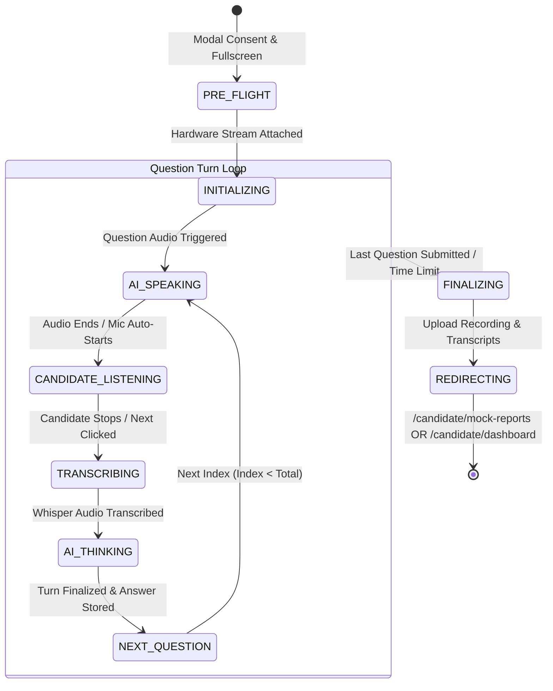

# IntervuOS Live Interview Page — Architecture, UI Components & Redesign Blueprint

> **Reference Specification for AI Agents & Engineers**  
> This document details the complete end-to-end architecture, UI components, state machines, audio/video pipelines, and redesign guidelines for the IntervuOS **Main Live Interview Page** (`LiveInterviewPage.jsx`).

---

## 1. Executive Summary & Page Purpose

The **Live Interview Page** is the core real-time assessment environment for IntervuOS. It hosts both:
1. **AI Mock Practice Interviews** (`mode: "MOCK"`) — Private candidate self-practice with instant STAR evaluations.
2. **Employer Campaign Assessments** (`mode: "CAMPAIGN"` / `"ASSIGNED"`) — Official candidate assessments recorded, transcribed, and scored for hiring teams.

**Route URIs**:
- `/candidate/interviews/:id/live`
- `/candidate/mock-interview/:id/live`

---

## 2. Component Hierarchy & File Structure

```
frontend/src/
├── features/interview/
│   ├── LiveInterviewPage.jsx                 # Top-level page container & fullscreen guardian
│   ├── components/
│   │   ├── AIAvatar/                         # AI Interviewer visual avatars
│   │   │   ├── AIAvatar.jsx                  # Video / Canvas / State switcher
│   │   │   ├── AIAvatar2D.jsx                # Video-based idle & talking loop player
│   │   │   └── types.ts / types.js           # Avatar states (IDLE, SPEAKING, THINKING, LISTENING)
│   │   └── ...
│   ├── VoiceTestPage.jsx                     # Voice synthesis diagnostic page
│   └── AvatarTestPage.jsx                    # Avatar animation diagnostic page
│
├── ui/interview-room/                        # Conversational AI Interview Workspace
│   ├── index.js                              # Module exports
│   ├── ConversationController.jsx            # Split-screen layout coordinator
│   ├── InterviewAI.jsx                       # Left panel: AI Avatar + Question Card
│   ├── InterviewCandidate.jsx                # Right panel: WebCam stream + Candidate Transcript + Mic
│   ├── CandidateTranscript.jsx               # Real-time transcribed text display
│   ├── CandidateStatus.jsx                   # Network, mic, and face status badges
│   ├── AITranscript.jsx                      # Spoken AI text streaming subtitle box
│   └── InterviewConversation.css             # Layout styles & keyframe animations
│
├── modules/interview/
│   ├── runtime/                              # Device, camera, and recording runtime
│   │   ├── InterviewRuntimeProvider.jsx      # MediaRecorder & hardware context
│   │   └── useInterviewRuntime.js            # Access camera stream, violations, state
│   ├── conversation/                         # Conversation turn orchestration
│   │   ├── useConversationState.js           # State machine (IDLE, SPEAKING, LISTENING, THINKING)
│   │   └── ConversationTurn.js               # Data model for current Q&A turn
│   └── services/
│       └── InterviewState.js                 # Local session synchronization
│
├── hooks/
│   ├── useInterview.js                       # Question navigation, answers map, session timer
│   ├── useQuestionVoice.js                   # Question audio playback via TTS
│   └── useVoiceRecorder.js                   # Web Audio microphone capture & Blob generation
│
└── services/
    ├── voice.service.js                      # Speech-to-text API (/api/voice/transcribe)
    ├── questionVoice.service.js              # Text-to-speech audio service
    └── api.js                                # Main Axios client
```

---

## 3. Real-Time State Machine & Data Flow

The live interview operates across 5 sequential runtime phases for every question:



### Turn States (`CONVERSATION_STATES`):
- `IDLE`: Initial hardware sync.
- `SPEAKING`: AI Avatar animates talking state (`talking.mp4`), audio plays via `questionVoiceService`.
- `LISTENING`: Mic turns active (green pulsing ring), `useVoiceRecorder` captures candidate's verbal response.
- `TRANSCRIBING`: Audio blob dispatched to backend Whisper STT (`/api/voice/transcribe`).
- `THINKING` / `ANALYZING`: Evaluating transcript against STAR methodology.

---

## 4. UI Breakdown & Layout Blueprint

The current UI follows a 3-tier desktop/mobile layout:

### Tier 1: Fixed Top Header Bar (`header`)
- **Left**: Recording badge (`REC • HD 1080p`), Job Role (`interview.jobRole`), and Candidate Name (`user.name`).
- **Right**:
  - **Countdown Timer**: Real-time minutes:seconds remaining. Automatically enters a red pulsing grace period at `00:00`.
  - **"End Interview" CTA**: Allows emergency manual early submission with confirmation.

### Tier 2: Split-Screen Viewport (`ConversationController.jsx`)
- **Left Column (50% desktop width)** — `InterviewAI.jsx`:
  1. Header with AI engine badge (`AI Interviewer • AI-OS v2.4`).
  2. Central 16:9 / 4:3 Avatar Card (`AIAvatar2D` video element with idle & talking transitions).
  3. Overlay Status Badge (e.g. `AI Speaking`, `Processing`, `AI Listening`).
  4. Bottom Question Prompt Card with formatted text & `<Volume2 />` audio replay button.
- **Right Column (50% desktop width)** — `InterviewCandidate.jsx`:
  1. Candidate webcam feed (`InterviewCamera`) with face detection and ambient lighting warnings.
  2. Live Microphone indicator with volume level visualizer.
  3. Real-Time Transcript Card (`CandidateTranscript.jsx`) displaying Whisper STT output.
  4. Action Bar: Manual "Submit Response & Next" button (or automatic turn transition).

### Tier 3: Session Finalization & Persistence (`UploadScreen.jsx`)
- When the interview ends, `usePersistence` packages:
  - Full WebM / MP4 video recording blob.
  - Array of `{ questionId, questionText, candidateAnswerText, timestamps }`.
- Automatically posts to `/api/interviews/:id/submit` and redirects candidate.

---

## 5. Design System Rules & Redesign Guidelines

When redesigning or restructuring this screen, strictly adhere to the established **Exponent Design System** in [styling.md](file:///c:/PROJECTS/IntervuOS/styling.md) and [AGENTS.md](file:///c:/PROJECTS/IntervuOS/AGENTS.md):

### 1. Color Tokens (Never use ad-hoc hexes or legacy Tailwind classes)
```css
--color-canvas: #0B0B0E;              /* Room background */
--color-surface: #16161E;             /* Video & Question container cards */
--color-surface-hover: #1E1E2A;       /* Interactive button hover */
--color-primary: #5B3AF2;             /* Single high-intent CTA */
--color-primary-hover: #472CD7;       /* Primary CTA hover */
--color-primary-tint: rgba(99, 56, 246, 0.15); /* Status pills & active borders */
--color-border: #232330;              /* 1px clean card border */
--color-border-active: #6338F6;       /* Active focus / selected border */
--color-text-primary: #FFFFFF;        /* Heading & Question text */
--color-text-secondary: #94A3B8;      /* Transcript & subtext */
--color-text-muted: #6E7A8A;          /* Timestamps & idle indicators */
--color-success: #10B981;             /* Live camera & mic ready */
--color-warning: #F59E0B;             /* Countdown timer < 5m warning */
--color-danger: #F43F5E;              /* Recording dot & timer grace period */
```

### 2. Prohibited Anti-Patterns:
- ❌ **No AI cliché glow blobs**: Remove `blur-[140px] bg-indigo-600/10` or floating gradients behind video cards.
- ❌ **No ALL-CAPS shouting headings**: Use sentence case with `font-medium` (500 weight) and `tracking-tight`.
- ❌ **No cards-inside-cards nesting**: Keep video viewport surfaces flat, clean, and bordered with `--color-border`.
- ❌ **No arbitrary width traps**: Use `h-screen w-full flex flex-col overflow-hidden` with responsive flexbox layout.

### 3. Single Primary CTA Rule:
- The active turn submit action ("Submit Answer" / "Next Question") receives the solid purple primary fill (`bg-[var(--primary)] text-white hover:bg-[var(--primary-hover)]`).
- All secondary actions (Replay Audio, End Interview, Settings) must use neutral tint or border styling.

---

## 6. Key Redesign Opportunities

If you are planning to restructure or upgrade the Live Interview Page, prioritize these enhancements:

1. **Integrated Question Progression Bar**:
   - Replace the legacy raw question text with a sleek segmented turn indicator (e.g. `Question 2 of 5` pill with animated step progress).
2. **Unified Audio/Video Surface Framing**:
   - Equalize aspect ratios and border radii between the AI Avatar viewport and Candidate webcam viewport for symmetrical elegance.
3. **Floating Subtitle / Transcript Stream**:
   - Make the candidate's real-time transcript feel like dynamic live closed captions rather than a bulky text area.
4. **Non-Intrusive Proctoring Alerts**:
   - If face tracking or tab-switching violations occur, display a subtle toast pill rather than a disruptive viewport overlay.
5. **Ultra-Low Latency State Transitions**:
   - Keep the micro-animations smooth using Framer Motion with `useReducedMotion()` accessibility support.

---

## 7. Verification Checklist

Before finalizing any changes to the Live Interview Page:
- [ ] Build compiles with 0 errors: `cmd /c "cd /d c:\PROJECTS\IntervuOS\frontend && npm run build"`
- [ ] Camera and mic streams bind without memory leaks.
- [ ] Voice TTS plays audio prompts automatically when question changes.
- [ ] STT transcription accurately submits candidate responses to backend.
- [ ] Fullscreen triggers cleanly on entry and resumes.
- [ ] Completed sessions redirect properly to reports without getting stuck.
