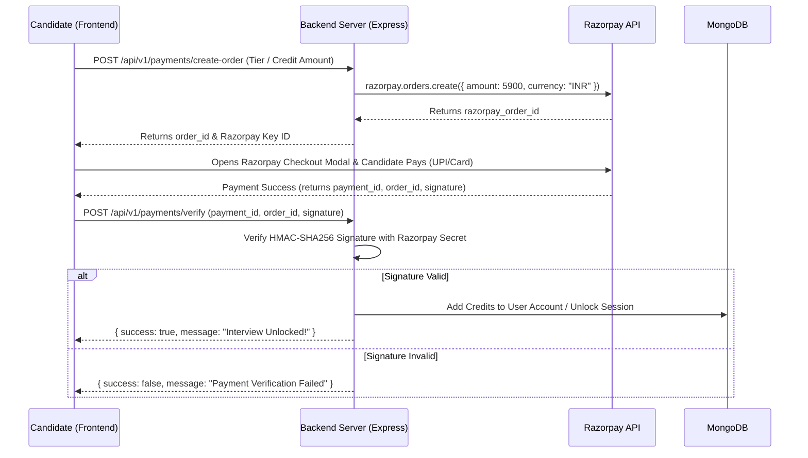
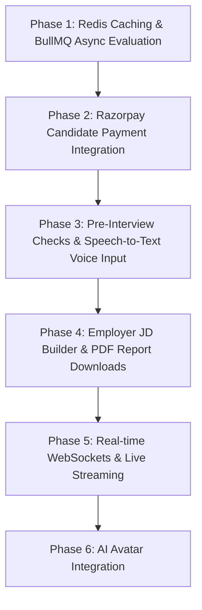

# ForkTalent: Detailed Project Roadmap, Architecture & Monetization Guide

This document outlines the comprehensive roadmap, architectural enhancements, and candidate monetization strategy for the ForkTalent platform.

---

## 1. Architectural & Infrastructure Enhancements

Integrating **Redis**, **BullMQ**, and **WebSockets / Channels** transforms the application from a synchronous web service into a high-performance, real-time enterprise AI platform.

```
                   +---------------------------------------------------+
                   |                 FRONTEND CLIENT                   |
                   +-------------------------+-------------------------+
                                             |  WebSockets (Low Latency)
                                             v
+-----------------------------------------------------------------------------------+
|                                 EXPRESS BACKEND                                   |
|                                                                                   |
|  +-------------------------------------+   +-----------------------------------+  |
|  |           REST API / WS             |   |        REDIS CACHE MEMORY         |  |
|  | Fast Response / Token Rate Limit    |   | Active Session State / Prompts    |  |
|  +------------------+------------------+   +-----------------------------------+  |
|                     |                                                             |
|                     v                                                             |
|          +----------------------+                                                 |
|          |    BULLMQ QUEUE      | (Async Evaluation, Speech Parsing, PDF/Resume)  |
|          +----------+-----------+                                                 |
+---------------------|-------------------------------------------------------------+
                      |
                      v
+-----------------------------------------------------------------------------------+
|                              BACKGROUND WORKERS                                   |
|  +------------------+   +-------------------+   +------------------------------+  |
|  | Groq AI Eval Job |   | Gemini Q-Gen Job  |   | Voice / TTS Processing Job   |  |
|  +------------------+   +-------------------+   +------------------------------+  |
+-----------------------------------------------------------------------------------+
```

### A. BullMQ + Redis (Asynchronous Background Job Queue)
* **Offload Final Evaluation**: AI evaluation via Groq/Gemini takes 5 to 15 seconds. Offload the evaluation task to BullMQ when the candidate finishes the interview. The backend immediately returns `202 Accepted`, allowing the UI to display a smooth "Evaluating interview..." progress screen.
* **Automatic Retries with Backoff**: If Gemini or Groq hits rate limits (429) or temporary outages, BullMQ automatically retries the job using exponential backoff without crashing user sessions.
* **Background Resume & Speech Processing**: PDF parsing, candidate skill extraction, and Text-to-Speech (TTS) audio rendering execute asynchronously in worker threads.
* **Scheduled Cleanup Jobs**: Automate cleanup of abandoned sessions or build periodic analytics aggregations using BullMQ cron jobs.

### B. Redis In-Memory Caching
* **Active Session State**: Store active interview transcript history in Redis memory for sub-millisecond retrieval on every Q&A turn instead of performing heavy MongoDB read/write operations continuously. Flush state to MongoDB when the interview finishes.
* **Prompt & Question Caching**: Frequently asked baseline questions or job role configurations can be cached in Redis to cut down redundant AI API calls, reducing response latency from ~2s to <50ms.
* **API Rate Limiting**: Implement sliding-window rate limiters per user or IP to protect Gemini and Groq API keys from quota exhaustion and denial-of-service (DoS) attacks.

### C. WebSockets / Real-Time Channels
* **Low-Latency Audio & Text Streaming**: Stream AI-generated question text and TTS audio chunks directly to the browser as tokens arrive.
* **Live Recruiter Monitoring**: Allow recruiters to monitor live interviews in real-time and view transcript generation live.
* **Real-time Status Indicators**: Display live states such as *"AI is thinking..."*, *"Synthesizing voice..."*, or *"Evaluating answer depth..."*.

---

## 2. Core AI Engine & Feature Roadmap

### A. Core AI Engine Improvements
* **Adaptive Follow-Up & Sub-Questioning**: Trigger clarification sub-questions when candidate answers are too brief (`< 20 words`) or ambiguous.
* **Multi-Model Failover Strategy**: Build automatic fallback logic (`Groq` -> `Gemini` -> `OpenAI`). If one AI provider fails, switch seamlessly without interrupting the interview.
* **Speech-to-Text (STT) Integration**: Integrate OpenAI Whisper or Groq Speech-to-Text for direct voice answers with real-time transcription feedback.
* **STAR Method & Structured Scoring**: Evaluate behavioral answers using the STAR Method (Situation, Task, Action, Result) alongside technical precision and communication metrics.

### B. Candidate Experience (UX/UI)
* **Pre-Interview System Check**: Add a 3-step check verifying Microphone, Camera, Speaker output, and Latency before starting.
* **Interactive Monaco Code Sandbox**: Embed a code editor (Monaco Editor) alongside the AI interviewer for software engineering roles.
* **Session Auto-Recovery**: Save interview progress in `localStorage` + Redis so candidates can reconnect seamlessly if their browser refreshes.

### C. Employer Dashboard & Anti-Cheating
* **Custom Job Description (JD) Builder**: Allow recruiters to upload custom JDs, set custom question counts, tech stacks, and pass thresholds.
* **Candidate Leaderboard & PDF Export**: Compare candidate scores with AI-generated rankings, radar charts, and downloadable PDF reports.
* **Proctoring Telemetry**: Detect tab switching, focus loss, and copy-paste actions to flag potential cheating.

---

## 3. Razorpay Candidate Monetization Strategy

### A. Pricing Model Options

```
                                  +---------------------------------------+
                                  |    MONETIZATION STRATEGY OPTIONS      |
                                  +-------------------+-------------------+
                                                      |
            +-----------------------------------------+-----------------------------------------+
            |                                         |                                         |
            v                                         v                                         v
+-----------------------+                 +-----------------------+                 +-----------------------+
|  OPTION 1: FIXED TIER |                 |  OPTION 2: COIN/CREDIT|                 |  OPTION 3: FREEMIUM   |
| (Best for Simplicity) |                 | (Best for Flexibility)|                 | (Best for Conversion) |
|                       |                 |                       |                 |                       |
| • 15 Min: ₹29         |                 | • Candidate buys      |                 | • 1st Mini Mock FREE  |
| • 30 Min: ₹59         |                 |   100 credits (₹100)  |                 | • Upgrade for full    |
| • 45 Min: ₹99         |                 | • 1 Min = 2 Credits   |                 |   PDF Report & Mocks  |
+-----------------------+                 +-----------------------+                 +-----------------------+
```

#### Option 1: Fixed-Time Interview Tiers (Recommended)
| Tier | Duration | Questions | Price (INR) | Features Included |
| :--- | :--- | :--- | :--- | :--- |
| **Quick Screen** | 15 Mins | 3–5 Qs | **₹29 – ₹39** | Basic AI Evaluation Score |
| **Standard Mock** | 30 Mins | 8–10 Qs | **₹59 – ₹79** | Full Transcript + Score Breakdown |
| **Deep-Dive Mock** | 45 Mins | 12+ Qs / Code | **₹99 – ₹129** | Detailed PDF Report + Strengths/Weaknesses |

#### Option 2: Prepaid Credit Wallet System
* **Formula**: ₹1 = 1 Credit (e.g., ₹100 = 100 Credits).
* **Usage**: Deduct 2 Credits per minute of mock interview.
* **Refund Guarantee**: If a 30-minute mock finishes in 20 minutes, deduct 40 credits and return remaining 20 credits to wallet balance.

#### Option 3: Freemium Hook
* **1 Free 5-Minute Mini Mock** (2 questions) for every new candidate to demonstrate AI capability.
* Upgrade prompt: *"Unlock complete 30-minute mock interview & detailed PDF report for ₹49!"*

---

### B. Technical Integration Architecture (Razorpay)



#### Code Snippets (Express Backend)

##### 1. Order Creation (`backend/src/modules/payments/controllers/createOrder.js`)
```javascript
import Razorpay from 'razorpay';

const razorpay = new Razorpay({
  key_id: process.env.RAZORPAY_KEY_ID,
  key_secret: process.env.RAZORPAY_KEY_SECRET,
});

export const createOrder = async (req, res) => {
  const { amountInRupees } = req.body; 
  
  const options = {
    amount: amountInRupees * 100, // Convert rupees to paise
    currency: "INR",
    receipt: `receipt_${Date.now()}`,
  };

  try {
    const order = await razorpay.orders.create(options);
    res.status(200).json({ success: true, order });
  } catch (error) {
    res.status(500).json({ success: false, error: error.message });
  }
};
```

##### 2. Payment Verification (`backend/src/modules/payments/controllers/verifyPayment.js`)
```javascript
import crypto from 'crypto';
import User from '../../users/models/User.js';

export const verifyPayment = async (req, res) => {
  const { razorpay_order_id, razorpay_payment_id, razorpay_signature, userId, creditsToAdd } = req.body;

  const body = razorpay_order_id + "|" + razorpay_payment_id;
  const expectedSignature = crypto
    .createHmac("sha256", process.env.RAZORPAY_KEY_SECRET)
    .update(body.toString())
    .digest("hex");

  if (expectedSignature === razorpay_signature) {
    await User.findByIdAndUpdate(userId, {
      $inc: { interviewCredits: creditsToAdd }
    });

    return res.status(200).json({ success: true, message: "Payment verified successfully!" });
  } else {
    return res.status(400).json({ success: false, message: "Invalid payment signature" });
  }
};
```

---

## 4. Employer B2B Lead Generation Strategy

Since employers contact you directly for custom hiring campaigns:

1. **Enterprise Call-to-Action**: Add a *"Hiring at Scale? Run automated AI screening campaigns"* landing card.
2. **Lead Capture Modal**: Capture Company Name, Work Email, Candidate Volume, Target Job Roles, and Phone Number.
3. **Admin Alert**: Save to `EmployerInquiry` in MongoDB and trigger instant email notification to your inbox (via Resend/Nodemailer).

---

## 5. Suggested Phased Execution Roadmap


