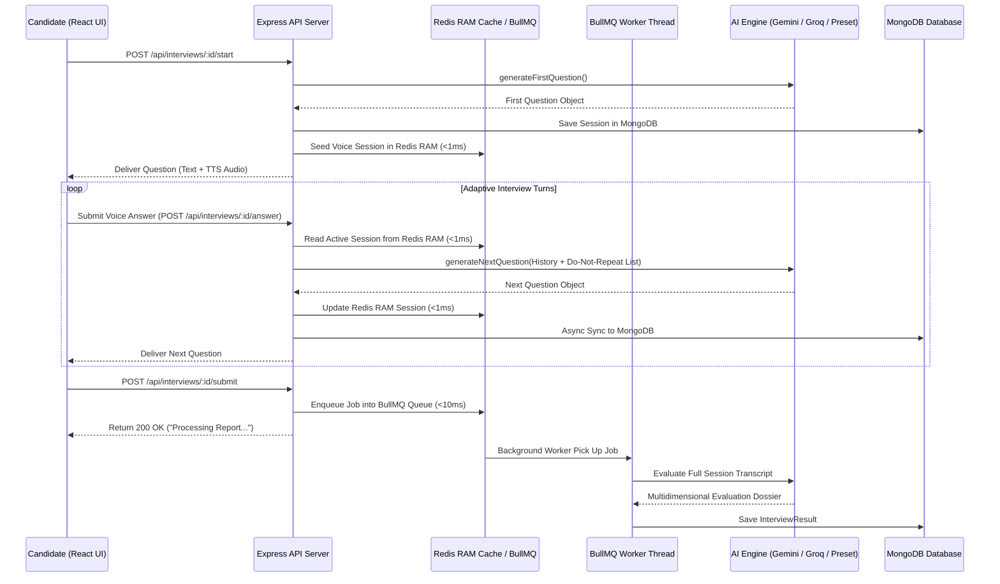

# 🚀 ForkTalent — Enterprise AI Interviewer & Candidate Evaluation Platform

<div align="center">


[](https://nodejs.org/)
[](https://react.dev/)
[](https://expressjs.com/)
[](https://www.mongodb.com/)
[](https://redis.io/)
[](https://bullmq.io/)
[](https://tailwindcss.com/)
[](https://groq.com/)
[](LICENSE)

<p align="center">
  <b>An enterprise-grade, full-stack AI recruitment and mock interview platform.</b><br/>
  Powered by an adaptive multi-model AI engine (<b>Google Gemini 1.5 Flash</b> & <b>Groq Llama 3</b>), sub-millisecond <b>Redis Session Caching</b>, <b>BullMQ Async Workers</b>, real-time speech processing (<b>Groq Whisper STT</b> & <b>Edge TTS</b>), interactive <b>3-State AI Avatar</b>, visual anti-cheating proctoring (<b>MediaPipe</b>), <b>Resumable Chunked Video Uploads</b>, customizable <b>Campaign Question Modes</b>, and a unified <b>Razorpay Credit Wallet</b>.
</p>

</div>

---

## 📌 Table of Contents

- [ Overview](#-overview)
- [✨ Key Features & Innovations](#-key-features--innovations)
- [⚡ High-Performance Architecture](#-high-performance-architecture)
- [🏗️ End-to-End System Workflow](#️-end-to-end-system-workflow)
- [💻 Technology Stack](#-technology-stack)
- [📂 Repository Architecture](#-repository-architecture)
- [⚙️ Environment Configuration](#️-environment-configuration)
- [🚀 Quick Start & Local Setup](#-quick-start--local-setup)
- [📊 Evaluation Schema & Candidate Dossier](#-evaluation-schema--candidate-dossier)
- [💳 Monetization & Credit Wallet Model](#-monetization--credit-wallet-model)
- [🔌 API Reference](#-api-reference)
- [🤝 Contributing & License](#-contributing--license)

---

## 🔍 Overview

**ForkTalent** eliminates screening bottlenecks in technical hiring while empowering candidates to master technical interviews. It serves two distinct personas seamlessly:

1. **For Candidates**: An interactive, realistic AI mock interview simulator featuring voice & text questioning, adaptive follow-ups, dynamic difficulty calibration, 3D/2D visual avatar responses, and multidimensional feedback reports.
2. **For Employers**: An automated screening platform to create requisitions, configure custom campaign question banks, invite candidates, monitor live sessions, review AI-generated candidate rankings, inspect audio/video recordings, and detect proctoring violations automatically.

---

## ✨ Key Features & Innovations

### 🎙️ Adaptive Multi-Model & Campaign Question Engine
- **Provider Orchestration**: Seamlessly delegates adaptive question generation to **Google Gemini 1.5 Flash** and post-interview candidate scoring to **Groq Llama 3** with dynamic failover handling.
- **3 Flexible Campaign Modes**:
  - 🤖 **AI-Adaptive**: Gemini AI dynamically generates questions live based on role & topics.
  - 🎯 **Employer Preset**: AI asks ONLY the employer's exact pre-defined question list in sequence.
  - 🔀 **Hybrid Campaign**: AI asks employer preset questions first, then seamlessly transitions to adaptive AI follow-ups.
- **Bulk Question Importer Modal**: Interactive CSV, TXT, and JSON question bank file parser with syntax guide popup and validation.
- **Smart Prompt Engineering**: Prioritizes standard, high-frequency technical interview questions (Virtual DOM, Closures, Event Loop, REST vs GraphQL, etc.) designed for clear verbal articulation.
- **Strict Deduplication System**: Enforces an explicit `STRICT DO NOT REPEAT LIST` to prevent identical or duplicate questions within a session.

### ⚡ Sub-Millisecond Redis RAM Architecture
- **Real-Time Voice Session Memory**: Stores active question state, countdown timers, and avatar states in **Redis RAM (sub-1ms latency)**, eliminating database I/O bottlenecks during live voice turns.
- **Non-Blocking BullMQ Queues**: Heavy AI evaluation jobs and video merges are delegated to asynchronous Redis background workers, ensuring instantaneous `< 50ms` API responses.
- **Database Cache Acceleration**: Caches MongoDB queries for User Profiles, Resumes, and Job Requisitions with automatic TTL memory invalidation (**14.9x query speedup**).
- **API Rate Limiting**: Protects AI generation endpoints with Redis-backed sliding window rate limiters.

### 📹 Resumable Chunked Uploads & Time-Left Progress UI
- **Tab & Network Fault Tolerance**: Candidate interview video recordings are chunked into small 2MB/5MB payloads tracked in Redis Sets (`upload:chunks:<uploadId>`). If Wi-Fi drops or a browser tab closes, upload resumes seamlessly without losing progress.
- **Background Cloudinary Merge**: BullMQ workers assemble video chunks and upload final recordings to Cloudinary asynchronously.
- **Live Progress Loader**: Custom frontend progress indicators (`UploadScreen.jsx`, `UploadProgress.jsx`) provide real-time percentage indicators and live **"⏱️ ~14s remaining"** countdown timers.

### 🔊 Multimodal Voice & Visual Avatar
- **Speech-to-Text (STT)**: Direct voice response transcription powered by **Groq Whisper (`whisper-large-v3`)**.
- **Text-to-Speech (TTS)**: Conversational audio synthesis powered by **Node Edge TTS** (`en-US-AriaNeural`).
- **3-State AI Avatar**: High-performance avatar player with continuous 200ms opacity transitions (`Talking` / `Listening` / `Thinking`).
- **Visual Anti-Cheating Telemetry**: Computer vision tracking powered by **MediaPipe Tasks Vision** to monitor face presence, camera connection, and focus loss.

### 💳 Unified Credit Wallet & Razorpay Monetization
- **1 Credit = 1 Interview Minute**: Transparent utility metric for candidates.
- **Starter Grant**: 15 free credits automatically awarded upon registration.
- **Custom Top-Up Rules**: Minimum custom purchase set to **20 Credits (₹50)**.
- **Razorpay Payment Integration**: Server-side price calculation, HMAC-SHA256 signature verification, idempotency protection against replay attacks, and webhook listeners.

---

## ⚡ High-Performance Architecture

Single Redis Instance topology using isolated key namespaces:

```
┌────────────────────────────────────────────────────────────────────────┐
│                        SINGLE REDIS DATABASE                           │
│                                                                        │
│  ├── Voice Session Cache  👉 "voice:session:<interviewId>:<userId>"    │
│  ├── BullMQ AI Queues     👉 "bull:heavy-ai-evaluation:*"              │
│  ├── BullMQ Video Queues  👉 "bull:video-upload-queue:*"               │
│  ├── Database Query Cache 👉 "cache:user:<userId>"                     │
│  ├── API Rate Limits      👉 "rl:ai:<userId>"                          │
│  └── Upload Chunks Set    👉 "upload:chunks:<uploadId>"                │
└────────────────────────────────────────────────────────────────────────┘
```

---

## 🏗️ End-to-End System Workflow



---

## 💻 Technology Stack

### Frontend
- **Framework**: React 19 + Vite 7
- **Styling**: Tailwind CSS v4, Custom Dark Glassmorphism Design System
- **State & Routing**: React Router v7, React Hook Form + Zod
- **Animations & Graphics**: Framer Motion, Three.js, `@react-three/fiber`, `@react-three/drei`
- **Computer Vision**: `@mediapipe/tasks-vision`
- **HTTP & Auth**: Axios, `@react-oauth/google`

### Backend
- **Runtime**: Node.js (ES Modules)
- **Web Framework**: Express v5
- **Database**: MongoDB via Mongoose v9
- **In-Memory Cache & Queues**: **Redis** (`ioredis`), **BullMQ** (`bullmq`)
- **Rate Limiting**: `express-rate-limit`, `rate-limit-redis`
- **Validation**: Zod v4
- **Authentication**: JWT (JSON Web Tokens), `cookie-parser`, `bcryptjs`, Google Auth Library
- **Cloud Storage**: Cloudinary (Resumes & Recording Videos)
- **Payments**: Razorpay Node SDK (`razorpay`)

### AI & Speech Infrastructure
- **LLM Providers**: `@google/genai` (Google Gemini 1.5 Flash), `groq-sdk` (Groq Llama 3.1 8B Instant)
- **Speech-to-Text (STT)**: Groq Whisper (`whisper-large-v3`)
- **Text-to-Speech (TTS)**: `node-edge-tts` (Microsoft Edge Neural Voices)

---

## 📂 Repository Architecture

```
IntervuOS/
├── package.json                    # Root scripts & workspace orchestration
├── docker-compose.yml              # Redis container setup
├── AI_INTERVIEW_FLOW.md            # Detailed AI sequence specifications
├── RAZORPAY_CREDIT_SYSTEM_FLOW.md  # Monetization & credit system documentation
│
├── backend/                        # Express v5 REST API & AI Engine
│   ├── src/
│   │   ├── server.js               # Entry point
│   │   ├── app.js                  # Express app setup & middleware
│   │   ├── config/                 # DB, Redis, Cloudinary, Razorpay configs
│   │   ├── middleware/             # Auth, RateLimiter, error handling, upload
│   │   ├── queues/                 # BullMQ Queue declarations
│   │   ├── workers/                # BullMQ background workers (AI evaluation, video)
│   │   ├── shared/                 # Cache & storage utilities
│   │   └── modules/
│   │       ├── auth/               # Signup, Login, Google OAuth
│   │       ├── interview/          # Session cache, engine, Gemini/Groq/Preset providers
│   │       ├── upload/             # Resumable chunked upload controllers
│   │       ├── voice/              # STT Whisper & TTS Edge controllers
│   │       ├── users/              # User profiles, credits, resume parser
│   │       └── payments/           # Razorpay checkout & webhook handlers
│   └── package.json
│
└── frontend/                       # React 19 Single Page Application
    ├── src/
    │   ├── app/                    # Application setup & main router
    │   ├── components/             # AvatarPlayer & shared UI primitives
    │   ├── features/               # Feature domain modules (Auth, Interview, Admin)
    │   ├── services/               # API service layer (Axios)
    │   └── ui/                     # Shared UI layout components
    └── package.json
```

---

## ⚙️ Environment Configuration

Create a `.env` file in the `backend/` directory:

```env
# Server Configuration
PORT=5000
NODE_ENV=development
FRONTEND_URL=http://localhost:5173

# Database & Cache
MONGODB_URI=mongodb://127.0.0.1:27017/IntervuOS
REDIS_HOST=127.0.0.1
REDIS_PORT=6379
REDIS_PASSWORD=

# Security
JWT_SECRET=your_jwt_secret_key_here
JWT_EXPIRES_IN=7d

# AI Providers
GEMINI_API_KEY=your_google_gemini_api_key
GROQ_API_KEY=your_groq_api_key

# Cloud Storage
CLOUDINARY_CLOUD_NAME=your_cloudinary_cloud_name
CLOUDINARY_API_KEY=your_cloudinary_api_key
CLOUDINARY_API_SECRET=your_cloudinary_api_secret

# Payments
RAZORPAY_KEY_ID=your_razorpay_key_id
RAZORPAY_KEY_SECRET=your_razorpay_key_secret
RAZORPAY_WEBHOOK_SECRET=your_razorpay_webhook_secret
```

---

## 🚀 Quick Start & Local Setup

### Prerequisites
- **Node.js**: v18.0.0 or higher
- **MongoDB**: Local MongoDB server or MongoDB Atlas
- **Docker**: Recommended for local Redis container

### 1. Clone & Install Dependencies

```bash
# Clone the repository
git clone https://github.com/Amansinghhggg/AI-interviewer.git
cd AI-interviewer

# Install root dependencies
npm install

# Install backend dependencies
cd backend && npm install && cd ..

# Install frontend dependencies
cd frontend && npm install && cd ..
```

### 2. Start Redis via Docker

```bash
docker compose up -d
```

### 3. Launch Development Environment

Run both Express Backend and React Frontend concurrently:

```bash
npm run dev
```

- **Frontend Interface**: `http://localhost:5173`
- **Backend REST API**: `http://localhost:5000`

---

## 📊 Evaluation Schema & Candidate Dossier

Every finished session generates a multidimensional evaluation report:

```json
{
  "scores": {
    "overall": 8.8,
    "technicalAccuracy": 9.0,
    "communication": 8.5,
    "problemSolving": 8.8,
    "confidence": 8.7
  },
  "recommendation": "STRONG_HIRE",
  "summary": "Candidate demonstrated strong understanding of React Virtual DOM performance and Redis in-memory session caching.",
  "strengths": [
    "Crisp, structured verbal explanations of asynchronous I/O",
    "Solid grasp of database query optimization"
  ],
  "weaknesses": [
    "Could elaborate deeper on distributed lock failure modes"
  ],
  "questionBreakdown": [
    {
      "questionId": 1,
      "score": 9,
      "feedback": "Accurate explanation of virtual DOM diffing and batch updates."
    }
  ]
}
```

---

## 💳 Monetization & Credit Wallet Model

| Tier | Credit Volume | Price Per Credit | Discount Rate |
|---|---|---|---|
| **Standard** | 20 – 49 Credits | ₹2.50 | Base Rate (Min ₹50) |
| **Bulk Pack** | 50+ Credits | ₹1.80 | **28% OFF** |

* **Signup Bonus**: 15 free interview credits automatically granted upon account creation.
* **Minimum Top-Up**: 20 Credits (₹50 minimum payment).

---

## 🔌 API Reference

- `POST /api/interviews/:id/start` — Initialize interview session & seed Redis RAM cache.
- `POST /api/interviews/:id/answer` — Submit candidate response & fetch next adaptive question.
- `POST /api/interviews/:id/submit` — Submit interview & trigger background BullMQ evaluation.
- `POST /api/voice/transcribe` — Convert candidate audio response to text via Groq Whisper.
- `POST /api/voice/speak` — Synthesize TTS audio response.
- `POST /api/upload/chunk` — Upload 2MB recording chunk.
- `GET /api/upload/status/:uploadId` — Check upload resumption state.

---

## 🤝 Contributing & License

Distributed under the **ISC License**. Designed and developed with ❤️ for the future of technical hiring.
