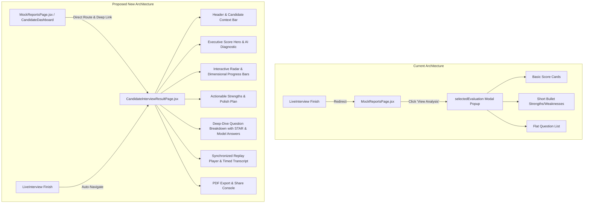

# IntervuOS: Candidate Result & Performance Workspace Redesign Context

> **Comprehensive Architecture, UI/UX Blueprint & Engineering Specification**  
> *Targeted Redesign for the Candidate View Result & Evaluation Experience in IntervuOS.*

---

## 1. Executive Summary & Vision

The **Candidate View Result Page** is one of the most critical touchpoints in the entire IntervuOS platform. For a candidate practicing mock interviews or reviewing performance after a company assessment, this page transforms raw interview recordings and telemetry into an **empowering, high-trust AI coaching masterclass**.

### The Core Problem Today
1. **Cramped Popup Modal vs. Full Dedicated Workspace**:
   Currently, candidates view their mock evaluations inside a restricted modal dialog (`selectedEvaluation` in `MockReportsPage.jsx`). This prevents deep analysis, cuts off charts, lacks URL shareability, and prevents bookmarking or deep-linking.
2. **Missing Media Replay & Timed Transcript**:
   While the Employer dashboard features a synchronized Replay player and timeline events, candidates cannot review their recording or inspect where they paused, hesitated, or excelled against specific questions.
3. **Superficial Question Feedback**:
   Current question analysis displays basic text scores and brief comments without structured **STAR (Situation, Task, Action, Result) methodology**, model answers ("What an ideal answer looks like"), or concrete coaching guidance.
4. **Opaque Employer Campaigns**:
   Candidates who finish company-assigned campaigns see a generic "Evaluation Under Review" pill with zero visibility into status or released candidate feedback.
5. **Design System Inconsistencies**:
   Ad-hoc styling, legacy class names, and missing strict adherence to the IntervuOS Linear/Stripe aesthetic (`styling.md`).

### The Target State: A World-Class AI Performance Workspace
We will restyle, restructure, and elevate the candidate result experience into a **full-page, responsive, data-dense, and human-crafted workspace** (`CandidateInterviewResultPage.jsx` & enhanced `MockReportsPage.jsx`) featuring:
- **Executive Diagnostic Hero**: Overall score (/10), readiness verdict, and AI hiring manager summary.
- **Interactive Competency Radar & Multi-Axis Analytics**: Technical Depth, Communication, Problem Solving, Confidence, and Topic Coverage.
- **STAR-Method Question-by-Question Deep Dive**: Detailed candidate answer vs. AI model answer, strengths, flaws, and actionable coaching tips.
- **Synchronized Video/Audio Replay & Interactive Transcript**: Jump to exact question timestamps directly from the evaluation cards.
- **Actionable Growth Roadmap**: Categorized key strengths, priority polish areas, and curated prep topics.
- **Shareable Link & Printable / Exportable PDF Performance Report**: One-click PDF report export and shareable links.

---

## 2. Current Architecture vs. Target Architecture



---

## 3. Detailed Component & Section Blueprint

### Section 1: Top Navigation & Candidate Context Bar
- **Back Navigation**: Quick return button to `Past Interviews` (`/candidate/mock-reports`) or `Dashboard`.
- **Interview Meta Badge**: Role title (e.g., *Full Stack Engineer - 3-5 Years*), mode badge (*AI Mock Practice* vs *Employer Assessment*), evaluated date, duration.
- **Action Console**:
  - **Single Primary CTA**: *"Take Another Mock Interview"* (for mock mode) or *"View Action Plan"*.
  - **Secondary Actions (Tint Fill)**: *"Export PDF Report"*, *"Share Evaluation Link"*.

### Section 2: Executive Diagnostic & Overall Score Hero
- **Score Dial / Key Value Display**:
  - Prominent overall rating (e.g. `8.4 / 10`) with semantic coloring (`--color-success` $\ge 7.0$, `--color-warning` $5.0-6.9$, `--color-danger` $< 5.0$).
  - Recommendation status tag: `Strong Hire`, `Hire`, `Borderline`, or `Needs Improvement`.
- **AI Executive Summary**:
  - High-level qualitative assessment synthesizing interview performance across clarity, depth, and poise.
  - Border-left accent highlight (`border-l-2 border-[var(--color-primary)]`).

### Section 3: Performance Radar & Metric Breakdown
- **Radar Chart**:
  - 5-axis visualization: Technical Depth, Problem Solving, Communication, Confidence, Topic Coverage.
  - Built with Recharts `ResponsiveContainer`, styled with `--color-surface` and `--color-primary` translucent fills.
- **Metric Gauges / Progress Bars**:
  - 4 high-density metric rows showing exact numerical scores (/10) and smooth animated progress bars.

### Section 4: Actionable Growth Roadmap (Strengths vs. Polish Areas)
- **2-Column Comparative Layout**:
  - **Key Strengths (Emerald Tint)**: Specific competencies and behaviors executed well with numbered indicators (`01`, `02`, `03`).
  - **Critical Areas for Growth (Amber / Rose Tint)**: Exact gaps identified, with concrete tips on what was missing.

### Section 5: Question-by-Question Deep Dive with STAR & Model Answers
- **Interactive Question Cards**:
  - Question header with index badge (`Q1`, `Q2`), topic tag, difficulty pill, and score (/10).
  - Expandable / Collapsible accordions with smooth motion.
  - **Candidate Answer Review**: Full transcribed answer.
  - **AI STAR Feedback Analysis**:
    - **S/T (Situation & Task)**: Did the candidate set up context clearly?
    - **A (Action)**: Did they specify their personal contribution and technical reasoning?
    - **R (Result)**: Did they quantify outcomes and lessons learned?
  - **"What an Ideal Answer Looks Like" (AI Model Answer)**: Clear benchmark demonstrating how a top-tier candidate answers this prompt.
  - **"Jump to Video/Audio" button**: Synchronizes the Replay player to the exact second this question began.

### Section 6: Synchronized Session Replay & Interactive Transcript
- **Replay Player**:
  - Clean video/audio playback with seek controls, speed selector (`1x`, `1.25x`, `1.5x`), and timeline markers.
  - Warnings & Proctoring telemetry (clean, candidate-friendly: tab switches, speaking pacing, pauses).
- **Timed Transcript Panel**:
  - Real-time scrolling transcript highlighting active spoken sentences as the recording plays.
  - Clickable transcript blocks to seek directly to that moment.

---

## 4. Design System Compliance & Styling Rules (`styling.md`)

All implementation details strictly adhere to IntervuOS design tokens:

### Centralized CSS Variables
```css
--color-canvas: #0B0B0E;              /* App background */
--color-surface: #16161E;             /* Card surface */
--color-surface-hover: #1E1E2A;       /* Hover surface */
--color-primary: #5B3AF2;             /* Single high-intent CTA */
--color-primary-hover: #472CD7;       /* Primary hover */
--color-primary-tint: rgba(99, 56, 246, 0.15); /* Selected pills & badges */
--color-border: #232330;              /* 1px border */
--color-border-active: #6338F6;       /* Focus & selected border */
--color-text-primary: #FFFFFF;        /* Heading text */
--color-text-secondary: #94A3B8;      /* Body & label text */
--color-text-muted: #6E7A8A;          /* Inactive text */
--color-text-accent: #C4B5FD;         /* Selected pill text & links */
--color-success: #10B981;             /* Emerald */
--color-warning: #F59E0B;             /* Amber */
--color-danger: #F43F5E;              /* Rose */
```

### Critical UX & Visual Guidelines
1. **Zero AI Clichés**: No `blur-3xl` glow blobs, no neon gradients, no decorative sparkles.
2. **Single Primary CTA Rule**: Only ONE solid purple button on the screen (`Start Next Mock` or `Action Plan`). All other actions use tint fill or clean outlines.
3. **Full Responsive Width**: No small `max-w-3xl` boxed-in containers; full `w-full px-4 sm:px-6 md:px-8 xl:px-10 py-6 sm:py-8` workspace.
4. **8px Spatial Scale**: Systematic `gap-4`, `gap-6`, `p-5`, `p-6` grid.
5. **Sentence Case & 500 Font Weight**: Clean typography without ALL-CAPS bold headings.

---

## 5. API Endpoints & Data Model

### 1. Mock Evaluation DTO
- **Route**: `GET /api/mock-interviews/evaluations/:resultId`
- **Controller**: `mockInterview.controller.js` -> `getMockEvaluation`
- **Returned DTO Payload**:
  ```json
  {
    "success": true,
    "result": {
      "candidate": { "id": "...", "name": "Aman", "email": "aman@example.com" },
      "interview": {
        "id": "...",
        "title": "Mock Interview - Full Stack Engineer",
        "jobRole": "Full Stack Engineer",
        "experienceLevel": "3-5 Years",
        "createdAt": "2026-08-15T12:00:00Z"
      },
      "summary": {
        "overallScore": 8.5,
        "interpretation": "Strong Hire Candidate",
        "recommendation": "STRONG_HIRE",
        "reasoning": "Demonstrated deep expertise in React state architecture...",
        "strengths": ["Clear system design breakdown", "Strong error boundary handling"],
        "weaknesses": ["Could elaborate more on Redis caching invalidation strategies"]
      },
      "charts": {
        "technical": 8.8,
        "communication": 8.5,
        "problemSolving": 8.2,
        "confidence": 8.6,
        "topicCoverage": 9.0
      },
      "recording": { "url": "...", "duration": 900 },
      "questionBreakdown": [
        {
          "questionId": "q1",
          "question": "How do you handle race conditions in React useEffect?",
          "answer": "I use abort controllers and cleanup functions...",
          "topic": "React & Web Fundamentals",
          "difficulty": "Medium",
          "scores": { "overall": 9.0, "technical": 9.2, "communication": 8.8 },
          "feedback": "Excellent explanation of AbortController cancellation patterns.",
          "starBreakdown": {
            "situation": "Identified the problem with out-of-order async responses",
            "action": "Implemented clean AbortController cancellation pattern",
            "result": "Avoided unmounted state updates cleanly"
          },
          "modelAnswer": "In React, race conditions happen when... The best approach is to pass an AbortSignal..."
        }
      ]
    }
  }
  ```

### 2. Employer-Assigned Interview DTO for Candidates
- **Route**: `GET /api/interviews/:id/results/:resultId`
- **Update**: Update route permission from `authorize("employer")` to `authorize("employer", "candidate")`.
- Backend `InterviewResultService.getCandidateResult` already supports candidate ownership verification.

---

## 6. Implementation Step-by-Step Plan

| Phase | Description | Key Files Involved |
| :--- | :--- | :--- |
| **Phase 1: Routing & Page Architecture** | Create dedicated `CandidateInterviewResultPage.jsx` and register routes in `App.jsx` (`/candidate/mock-reports/:resultId` and `/candidate/interviews/:id/results/:resultId`). Update route auth in `backend/src/modules/interview/routes/interview.routes.js`. | `App.jsx`, `interview.routes.js`, `CandidateInterviewResultPage.jsx` |
| **Phase 2: Full-Page Workspace Layout** | Build the candidate workspace container with responsive grid, context header, tab controls (`Performance Diagnostic` vs `Recording & Transcript`), and action console. | `CandidateInterviewResultPage.jsx` |
| **Phase 3: Executive Score Hero & Radar Analytics** | Implement the overall score dial, qualitative verdict, Recharts 5-axis Radar chart, and 4 dimension progress meters. | `CandidatePerformanceHero.jsx`, `CandidateRadarWidget.jsx` |
| **Phase 4: STAR Question Deep Dive & AI Model Answers** | Build rich expandable question cards with candidate transcript, score badges, STAR breakdown pills, feedback, and AI model answers. | `CandidateQuestionBreakdown.jsx` |
| **Phase 5: Replay Player & Timed Transcript Integration** | Integrate the `ReplayPlayer` and timeline synchronizer so clicking a question automatically seeks to that timestamp in the recording. | `ReplayPlayer.jsx`, `CandidateReplayWidget.jsx` |
| **Phase 6: PDF Export, Sharing & Past Interviews Hub** | Add printable report styling / PDF download modal and update `MockReportsPage.jsx` cards to navigate to the new full workspace seamlessly. | `PDFPreviewModal.jsx`, `MockReportsPage.jsx` |
| **Phase 7: Verification & Build Validation** | Run frontend production build (`npm run build`) to ensure 0 errors and test responsive desktop/mobile viewports. | Build verification |

---

## 7. Next Steps & Approval

Once this blueprint is reviewed, we will proceed with the phased execution to deliver a stunning, enterprise-grade candidate result workspace that elevates the entire IntervuOS user experience.
